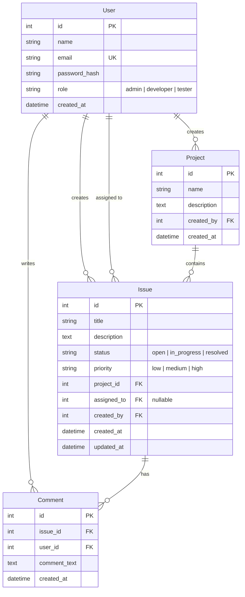
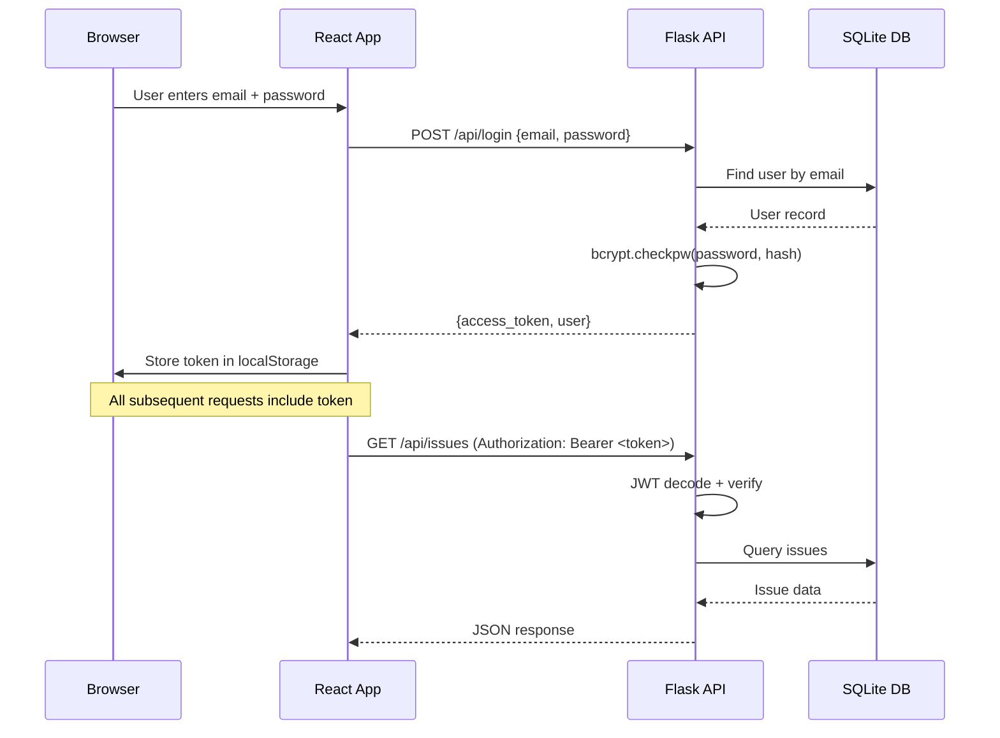
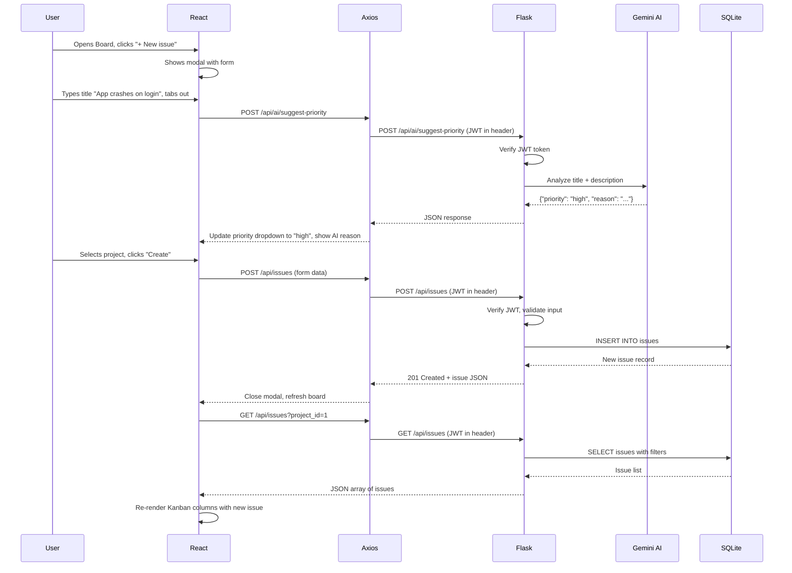

# BugTrack Pro — Complete Project Walkthrough

A comprehensive guide to the **BugTrack Pro** full-stack bug tracking application: its architecture, database, APIs, authentication, AI features, UI, and how to install & run it.

---

## Table of Contents

1. [Project Overview & Architecture](#1-project-overview--architecture)
2. [Installation & Setup](#2-installation--setup)
3. [Database Schema](#3-database-schema)
4. [Security & Authentication (JWT)](#4-security--authentication-jwt)
5. [Backend API Reference](#5-backend-api-reference)
6. [AI-Powered Features](#6-ai-powered-features)
7. [Frontend UI Walkthrough](#7-frontend-ui-walkthrough)
8. [How Data Flows (End-to-End)](#8-how-data-flows-end-to-end)

---

## 1. Project Overview & Architecture

BugTrack Pro is a full-stack issue/bug tracking system with:

| Layer | Technology | Purpose |
|-------|-----------|---------|
| **Backend** | Flask (Python) | REST API server |
| **Database** | SQLite via SQLAlchemy ORM | Data persistence |
| **Auth** | JWT (Flask-JWT-Extended) + bcrypt | Secure token-based auth |
| **AI** | Google Gemini API | Smart priority, duplicate detection, summaries |
| **Frontend** | React 19 + Vite | Single-page application |
| **Styling** | TailwindCSS + custom CSS | Clean, minimal design system |
| **Drag & Drop** | @hello-pangea/dnd | Kanban board interactions |
| **HTTP Client** | Axios | API communication with interceptors |

### Folder Structure

```
bugtrack-pro/
├── backend/
│   ├── app/
│   │   ├── __init__.py          # App factory, extension init, blueprint registration
│   │   ├── config.py            # Configuration (DB URI, JWT secrets, token expiry)
│   │   ├── models.py            # SQLAlchemy models (User, Project, Issue, Comment)
│   │   ├── auth/routes.py       # Authentication endpoints
│   │   ├── projects/routes.py   # Project CRUD endpoints
│   │   ├── issues/routes.py     # Issue CRUD + filtering + dashboard stats
│   │   ├── comments/routes.py   # Comment endpoints
│   │   └── ai/routes.py         # AI-powered endpoints (Gemini)
│   ├── bugtrack.db              # SQLite database file
│   ├── requirements.txt         # Python dependencies
│   └── run.py                   # Entry point
│
└── frontend/
    ├── src/
    │   ├── main.jsx             # React entry point
    │   ├── App.jsx              # Router + layout + auth guards
    │   ├── index.css            # Complete design system (575 lines)
    │   ├── api/axios.js         # Axios instance with JWT interceptors
    │   ├── context/AuthContext.jsx  # Global auth state management
    │   ├── components/
    │   │   ├── Navbar.jsx       # Top navigation bar
    │   │   └── PrivateRoute.jsx # Auth-guarded route wrapper
    │   └── pages/
    │       ├── LoginPage.jsx    # Sign in
    │       ├── RegisterPage.jsx # Create account
    │       ├── DashboardPage.jsx# Stats overview
    │       ├── ProjectsPage.jsx # Project management
    │       ├── KanbanBoard.jsx  # Drag-and-drop issue board
    │       ├── IssueDetailPage.jsx # Issue view/edit + comments
    │       └── ProfilePage.jsx  # User profile
    ├── index.html               # HTML shell
    ├── vite.config.js           # Vite config with API proxy
    └── package.json             # Node dependencies
```

---

## 2. Installation & Setup

### Prerequisites
- **Python 3.8+** installed
- **Node.js 18+** and **npm** installed
- (Optional) A **Google Gemini API key** for AI features

### Step 1 — Clone / Navigate to the Project

```bash
cd bugtrack-pro
```

### Step 2 — Backend Setup

```bash
# Navigate to backend
cd backend

# Create a Python virtual environment
python -m venv venv

# Activate it
# Windows:
.\venv\Scripts\Activate
# macOS/Linux:
source venv/bin/activate

# Install Python dependencies
pip install -r requirements.txt
```

**Dependencies installed** ([requirements.txt](file:///c:/Users/HP/.gemini/antigravity/scratch/bugtrack-pro/backend/requirements.txt)):

| Package | Version | Purpose |
|---------|---------|---------|
| Flask | 3.0.0 | Web framework |
| Flask-JWT-Extended | 4.6.0 | JWT authentication |
| Flask-SQLAlchemy | 3.1.1 | ORM for database |
| Flask-Migrate | 4.0.5 | Database migrations |
| Flask-CORS | 4.0.0 | Cross-origin requests |
| marshmallow | 3.20.1 | Serialization |
| bcrypt | 4.1.2 | Password hashing |
| google-genai | 0.3.0 | Gemini AI client |

### Step 3 — (Optional) Set Environment Variables

```bash
# For production, set proper secrets:
set SECRET_KEY=your-secret-key
set JWT_SECRET_KEY=your-jwt-secret
set GEMINI_API_KEY=your-gemini-api-key
```

> [!TIP]
> The app works out of the box with default secrets for development. The SQLite database file [bugtrack.db](file:///c:/Users/HP/.gemini/antigravity/scratch/bugtrack-pro/backend/bugtrack.db) is auto-created on first run.

### Step 4 — Start the Backend

```bash
python run.py
```

The Flask server starts on **http://localhost:5000**.

### Step 5 — Frontend Setup

Open a **new terminal**:

```bash
cd frontend

# Install npm dependencies
npm install

# Start the dev server
npm run dev
```

The Vite dev server starts on **http://localhost:5173** with API requests proxied to `localhost:5000`.

### Step 6 — Open the App

Navigate to **http://localhost:5173** in your browser. You'll see the Login page.

> [!IMPORTANT]
> Both servers must be running simultaneously. The Vite config ([vite.config.js](file:///c:/Users/HP/.gemini/antigravity/scratch/bugtrack-pro/frontend/vite.config.js)) proxies all `/api/*` requests to the Flask backend on port 5000.

---

## 3. Database Schema

The app uses **SQLite** via SQLAlchemy ORM. All 4 models are defined in [models.py](file:///c:/Users/HP/.gemini/antigravity/scratch/bugtrack-pro/backend/app/models.py).

### Entity Relationship Diagram



### Model Details

#### [User](file:///c:/Users/HP/.gemini/antigravity/scratch/bugtrack-pro/backend/app/models.py#5-29) — System users with role-based access

| Column | Type | Constraints | Description |
|--------|------|-------------|-------------|
| [id](file:///c:/Users/HP/.gemini/antigravity/scratch/bugtrack-pro/frontend/src/context/AuthContext.jsx#6-54) | Integer | PK, auto-increment | Unique user identifier |
| `name` | String(120) | NOT NULL | Display name |
| `email` | String(120) | UNIQUE, NOT NULL | Login credential |
| `password_hash` | String(256) | NOT NULL | bcrypt-hashed password |
| `role` | String(20) | NOT NULL, default="developer" | One of: `admin`, `developer`, `tester` |
| `created_at` | DateTime | auto-set | Registration timestamp (UTC) |

**Relationships**: Creates projects, creates issues, gets assigned issues, writes comments.

#### [Project](file:///c:/Users/HP/.gemini/antigravity/scratch/bugtrack-pro/backend/app/models.py#31-53) — Groups issues into logical projects

| Column | Type | Constraints | Description |
|--------|------|-------------|-------------|
| [id](file:///c:/Users/HP/.gemini/antigravity/scratch/bugtrack-pro/frontend/src/context/AuthContext.jsx#6-54) | Integer | PK | Unique project ID |
| `name` | String(200) | NOT NULL | Project name |
| `description` | Text | nullable | Project description |
| `created_by` | Integer | FK → users.id | Creator's user ID |
| `created_at` | DateTime | auto-set | Creation timestamp |

**Cascade**: Deleting a project deletes all its issues (`cascade="all, delete-orphan"`).

#### [Issue](file:///c:/Users/HP/.gemini/antigravity/scratch/bugtrack-pro/backend/app/models.py#55-89) — Bug/task tracked within a project

| Column | Type | Constraints | Description |
|--------|------|-------------|-------------|
| [id](file:///c:/Users/HP/.gemini/antigravity/scratch/bugtrack-pro/frontend/src/context/AuthContext.jsx#6-54) | Integer | PK | Unique issue ID |
| `title` | String(300) | NOT NULL | Short issue title |
| `description` | Text | nullable | Detailed description |
| [status](file:///c:/Users/HP/.gemini/antigravity/scratch/bugtrack-pro/backend/app/issues/routes.py#119-135) | String(20) | NOT NULL, default="open" | `open` \| `in_progress` \| `resolved` |
| [priority](file:///c:/Users/HP/.gemini/antigravity/scratch/bugtrack-pro/backend/app/ai/routes.py#25-71) | String(20) | NOT NULL, default="medium" | `low` \| `medium` \| `high` |
| `project_id` | Integer | FK → projects.id | Parent project |
| `assigned_to` | Integer | FK → users.id, nullable | Assignee |
| `created_by` | Integer | FK → users.id | Reporter |
| `created_at` | DateTime | auto-set | Created timestamp |
| `updated_at` | DateTime | auto-set, auto-update | Last modified timestamp |

**Cascade**: Deleting an issue deletes all its comments.

#### [Comment](file:///c:/Users/HP/.gemini/antigravity/scratch/bugtrack-pro/backend/app/models.py#91-109) — Discussion thread on an issue

| Column | Type | Constraints | Description |
|--------|------|-------------|-------------|
| [id](file:///c:/Users/HP/.gemini/antigravity/scratch/bugtrack-pro/frontend/src/context/AuthContext.jsx#6-54) | Integer | PK | Unique comment ID |
| `issue_id` | Integer | FK → issues.id | Parent issue |
| `user_id` | Integer | FK → users.id | Comment author |
| `comment_text` | Text | NOT NULL | Comment content |
| `created_at` | DateTime | auto-set | Posted timestamp |

---

## 4. Security & Authentication (JWT)

### How Authentication Works

The app uses **JSON Web Tokens (JWT)** for stateless authentication, implemented via `Flask-JWT-Extended`.



### Security Mechanisms

| Mechanism | Implementation | File |
|-----------|---------------|------|
| **Password Hashing** | bcrypt with auto-generated salt | [auth/routes.py](file:///c:/Users/HP/.gemini/antigravity/scratch/bugtrack-pro/backend/app/auth/routes.py) |
| **Token Generation** | `create_access_token(identity=user_id)` | [auth/routes.py](file:///c:/Users/HP/.gemini/antigravity/scratch/bugtrack-pro/backend/app/auth/routes.py) |
| **Token Expiry** | 1 hour (configurable in [config.py](file:///c:/Users/HP/.gemini/antigravity/scratch/bugtrack-pro/backend/app/config.py)) | [config.py](file:///c:/Users/HP/.gemini/antigravity/scratch/bugtrack-pro/backend/app/config.py) |
| **Route Protection** | `@jwt_required()` decorator on all protected routes | All route files |
| **CORS** | Allow all origins for `/api/*` routes | [__init__.py](file:///c:/Users/HP/.gemini/antigravity/scratch/bugtrack-pro/backend/app/__init__.py) |
| **401 Auto-Redirect** | Axios response interceptor clears token and redirects to `/login` | [axios.js](file:///c:/Users/HP/.gemini/antigravity/scratch/bugtrack-pro/frontend/src/api/axios.js) |
| **Input Validation** | Server-side checks on all POST/PUT endpoints | All route files |
| **Role-Based Deletion** | Only `admin` or creator can delete projects/issues | [projects/routes.py](file:///c:/Users/HP/.gemini/antigravity/scratch/bugtrack-pro/backend/app/projects/routes.py), [issues/routes.py](file:///c:/Users/HP/.gemini/antigravity/scratch/bugtrack-pro/backend/app/issues/routes.py) |

### Frontend Auth Flow

The [AuthContext.jsx](file:///c:/Users/HP/.gemini/antigravity/scratch/bugtrack-pro/frontend/src/context/AuthContext.jsx) provides global auth state:

- **[login(email, password)](file:///c:/Users/HP/.gemini/antigravity/scratch/bugtrack-pro/frontend/src/context/AuthContext.jsx#16-25)** — Calls `/api/login`, stores token + user in `localStorage`
- **[register(name, email, password, role)](file:///c:/Users/HP/.gemini/antigravity/scratch/bugtrack-pro/frontend/src/context/AuthContext.jsx#26-30)** — Calls `/api/register`, redirects to login
- **[logout()](file:///c:/Users/HP/.gemini/antigravity/scratch/bugtrack-pro/frontend/src/context/AuthContext.jsx#31-37)** — Clears `localStorage`, resets state
- **[refreshProfile()](file:///c:/Users/HP/.gemini/antigravity/scratch/bugtrack-pro/frontend/src/context/AuthContext.jsx#38-47)** — Re-fetches user data from `/api/profile`
- **`isAuthenticated`** — Boolean derived from token presence
- **[PrivateRoute](file:///c:/Users/HP/.gemini/antigravity/scratch/bugtrack-pro/frontend/src/components/PrivateRoute.jsx)** — Redirects unauthenticated users to `/login`

### Axios Interceptors

In [axios.js](file:///c:/Users/HP/.gemini/antigravity/scratch/bugtrack-pro/frontend/src/api/axios.js):

1. **Request Interceptor**: Automatically attaches `Authorization: Bearer <token>` header to every API call
2. **Response Interceptor**: On `401` response, clears stored credentials and redirects to `/login`

---

## 5. Backend API Reference

All endpoints are prefixed with `/api`. Source: backend route files.

### 5.1 Authentication — [auth/routes.py](file:///c:/Users/HP/.gemini/antigravity/scratch/bugtrack-pro/backend/app/auth/routes.py)

| Method | Endpoint | Auth | Description |
|--------|----------|------|-------------|
| `POST` | `/api/register` | ❌ | Register a new user |
| `POST` | `/api/login` | ❌ | Login and get JWT token |
| `GET` | `/api/profile` | ✅ | Get current user's profile |
| `GET` | `/api/users` | ✅ | List all users |

#### `POST /api/register`

**Request Body:**
```json
{
  "name": "Jane Smith",
  "email": "jane@example.com",
  "password": "securepass123",
  "role": "developer"          // optional: "admin" | "developer" | "tester"
}
```

**Validation Rules:**
- `name`, `email`, `password` are required
- `email` must be unique (returns `409` if duplicate)
- `role` must be one of: `admin`, `developer`, `tester` (defaults to `developer`)

**Response (201):**
```json
{
  "message": "User registered successfully",
  "user": { "id": 1, "name": "Jane Smith", "email": "jane@example.com", "role": "developer", "created_at": "..." }
}
```

#### `POST /api/login`

**Request Body:**
```json
{ "email": "jane@example.com", "password": "securepass123" }
```

**Response (200):**
```json
{
  "access_token": "eyJhbGciOiJIUzI1NiIs...",
  "user": { "id": 1, "name": "Jane Smith", "email": "jane@example.com", "role": "developer", "created_at": "..." }
}
```

**Error (401):** `{"error": "Invalid email or password"}`

---

### 5.2 Projects — [projects/routes.py](file:///c:/Users/HP/.gemini/antigravity/scratch/bugtrack-pro/backend/app/projects/routes.py)

| Method | Endpoint | Auth | Description |
|--------|----------|------|-------------|
| `POST` | `/api/projects` | ✅ | Create a new project |
| `GET` | `/api/projects` | ✅ | List all projects (newest first) |
| `GET` | `/api/projects/:id` | ✅ | Get project details with issue stats |
| `DELETE` | `/api/projects/:id` | ✅ | Delete project (admin or creator only) |

#### `GET /api/projects/:id` — Enhanced Response

Returns extra issue breakdowns:
```json
{
  "id": 1,
  "name": "BugTrack Pro",
  "description": "...",
  "created_by": 1,
  "creator_name": "Jane",
  "issue_count": 12,
  "issues_by_status":   { "open": 5, "in_progress": 3, "resolved": 4 },
  "issues_by_priority": { "low": 2, "medium": 7, "high": 3 }
}
```

#### Delete Authorization Logic:
```python
if user.role != "admin" and project.created_by != user_id:
    return 403  # Only admin or project creator can delete
```

---

### 5.3 Issues — [issues/routes.py](file:///c:/Users/HP/.gemini/antigravity/scratch/bugtrack-pro/backend/app/issues/routes.py)

| Method | Endpoint | Auth | Description |
|--------|----------|------|-------------|
| `POST` | `/api/issues` | ✅ | Create a new issue |
| `GET` | `/api/issues` | ✅ | List issues with filters |
| `GET` | `/api/issues/:id` | ✅ | Get single issue detail |
| `PUT` | `/api/issues/:id` | ✅ | Update issue fields |
| `DELETE` | `/api/issues/:id` | ✅ | Delete issue (admin/creator) |
| `PATCH` | `/api/issues/:id/status` | ✅ | Quick status update (for Kanban drag) |
| `GET` | `/api/dashboard/stats` | ✅ | Aggregated dashboard statistics |

#### `GET /api/issues` — Query Parameters (Filters)

| Parameter | Type | Example | Description |
|-----------|------|---------|-------------|
| [status](file:///c:/Users/HP/.gemini/antigravity/scratch/bugtrack-pro/backend/app/issues/routes.py#119-135) | string | `?status=open` | Filter by status |
| [priority](file:///c:/Users/HP/.gemini/antigravity/scratch/bugtrack-pro/backend/app/ai/routes.py#25-71) | string | `?priority=high` | Filter by priority |
| `project_id` | int | `?project_id=3` | Filter by project |
| `assigned_to` | int | `?assigned_to=5` | Filter by assignee |
| `search` | string | `?search=login` | Search in title + description (case-insensitive) |

#### `PATCH /api/issues/:id/status` — Kanban Status Update

This is used by the **Kanban board drag-and-drop**. It only updates the status field for fast column transitions.

```json
{ "status": "in_progress" }
// Valid values: "open", "in_progress", "resolved"
```

#### `GET /api/dashboard/stats` — Response

```json
{
  "total_issues": 42,
  "by_status": { "open": 15, "in_progress": 12, "resolved": 15 },
  "by_priority": { "low": 10, "medium": 22, "high": 10 },
  "recent_issues": [ /* last 5 issues */ ]
}
```

---

### 5.4 Comments — [comments/routes.py](file:///c:/Users/HP/.gemini/antigravity/scratch/bugtrack-pro/backend/app/comments/routes.py)

| Method | Endpoint | Auth | Description |
|--------|----------|------|-------------|
| `POST` | `/api/issues/:id/comments` | ✅ | Add a comment to an issue |
| `GET` | `/api/issues/:id/comments` | ✅ | List all comments (oldest first) |

Comments are nested under issues and sorted chronologically.

---

### 5.5 AI Endpoints — [ai/routes.py](file:///c:/Users/HP/.gemini/antigravity/scratch/bugtrack-pro/backend/app/ai/routes.py)

All AI endpoints are under `/api/ai` and detailed in the next section.

---

## 6. AI-Powered Features

The app integrates **Google Gemini** (`gemini-2.5-flash` model) for three intelligent features. All have **graceful fallbacks** when the API key is not configured.

| Feature | Endpoint | Fallback Behavior |
|---------|----------|--------------------|
| Priority Suggestion | `POST /api/ai/suggest-priority` | Defaults to "medium" |
| Duplicate Detection | `POST /api/ai/check-duplicate` | Keyword matching (≥2 shared words) |
| Smart Summarization | `POST /api/ai/summarize` | Truncates to first 200 characters |

### 6.1 `POST /api/ai/suggest-priority`

Analyzes a bug's title and description to recommend `low`, `medium`, or `high` priority.

**Request:**
```json
{ "title": "App crashes on login", "description": "When entering incorrect password 3 times..." }
```

**AI Response:**
```json
{ "priority": "high", "reason": "App crashes indicate a critical stability issue.", "ai_powered": true }
```

**Where it's used in the UI**: When creating a new issue on the Kanban Board, the priority is **auto-suggested by AI** when the user tabs out of the title or description field (via `onBlur`).

### 6.2 `POST /api/ai/check-duplicate`

Compares a new issue against existing issues (up to 30) to find potential duplicates.

**Request:**
```json
{ "title": "Login button not working", "project_id": 1 }
```

### 6.3 `POST /api/ai/summarize`

Generates a concise 1-2 sentence summary of a long issue description.

**Where it's used in the UI**: On the Issue Detail page, a ✨ **Summarize** button appears if the description exceeds 100 characters.

---

## 7. Frontend UI Walkthrough

### Application Routing

Defined in [App.jsx](file:///c:/Users/HP/.gemini/antigravity/scratch/bugtrack-pro/frontend/src/App.jsx):

| Route | Component | Auth Required | Description |
|-------|-----------|:---:|-------------|
| `/login` | [LoginPage](file:///c:/Users/HP/.gemini/antigravity/scratch/bugtrack-pro/frontend/src/pages/LoginPage.jsx#6-59) | ❌ | Sign in form |
| `/register` | [RegisterPage](file:///c:/Users/HP/.gemini/antigravity/scratch/bugtrack-pro/frontend/src/pages/RegisterPage.jsx#5-69) | ❌ | Registration form |
| `/` | [DashboardPage](file:///c:/Users/HP/.gemini/antigravity/scratch/bugtrack-pro/frontend/src/pages/DashboardPage.jsx#7-85) | ✅ | Stats overview |
| `/projects` | [ProjectsPage](file:///c:/Users/HP/.gemini/antigravity/scratch/bugtrack-pro/frontend/src/pages/ProjectsPage.jsx#6-123) | ✅ | Project management |
| `/board` | [KanbanBoard](file:///c:/Users/HP/.gemini/antigravity/scratch/bugtrack-pro/frontend/src/pages/KanbanBoard.jsx#13-236) | ✅ | Issue board with drag & drop |
| `/issues/:id` | [IssueDetailPage](file:///c:/Users/HP/.gemini/antigravity/scratch/bugtrack-pro/frontend/src/pages/IssueDetailPage.jsx#7-229) | ✅ | Issue detail + comments |
| `/profile` | [ProfilePage](file:///c:/Users/HP/.gemini/antigravity/scratch/bugtrack-pro/frontend/src/pages/ProfilePage.jsx#4-52) | ✅ | User profile |
| `*` | Redirects to `/` | — | Catch-all redirect |

If authenticated, visiting `/login` or `/register` auto-redirects to `/`. If unauthenticated, protected routes redirect to `/login`.

---

### 7.1 Login Page — [LoginPage.jsx](file:///c:/Users/HP/.gemini/antigravity/scratch/bugtrack-pro/frontend/src/pages/LoginPage.jsx)

**What you see:** A centered card with the BugTrack Pro bug icon, email and password fields, and a "Sign in" button.

**How to use:**
1. Enter your registered email and password
2. Click **Sign in** (button shows "Signing in..." during the request)
3. On success → redirected to Dashboard
4. On error → a red error box appears above the form
5. If you don't have an account, click **Register** link at the bottom

---

### 7.2 Register Page — [RegisterPage.jsx](file:///c:/Users/HP/.gemini/antigravity/scratch/bugtrack-pro/frontend/src/pages/RegisterPage.jsx)

**What you see:** A card with four fields: Full name, Email, Password, and a Role dropdown.

**How to use:**
1. Fill in your name, email, and password (min 6 characters)
2. Select a role:
   - **Developer** — Default role for team members
   - **Tester** — For QA team members
   - **Admin** — Full access including delete permissions
3. Click **Create account**
4. On success → redirected to Login page to sign in
5. Already have an account? Click **Sign in** link

---

### 7.3 Dashboard — [DashboardPage.jsx](file:///c:/Users/HP/.gemini/antigravity/scratch/bugtrack-pro/frontend/src/pages/DashboardPage.jsx)

**What you see:** A welcome greeting with your name, followed by 5 stat cards and a recent issues list.

**Stat Cards (top row):**

| Card | Color | Shows |
|------|-------|-------|
| Total Issues | Default | Count of all issues |
| Open | Blue | Open issues count |
| In Progress | Amber | In-progress issues |
| Resolved | Green | Resolved issues |
| High Priority | Red | High-priority issues |

**Recent Issues (bottom section):**
- Shows the 5 most recently created issues
- Each row shows: title, priority badge, status badge, project name
- Click any issue → navigates to its detail page
- "View board →" button links to the Kanban Board

**Data source:** `GET /api/dashboard/stats`

---

### 7.4 Projects Page — [ProjectsPage.jsx](file:///c:/Users/HP/.gemini/antigravity/scratch/bugtrack-pro/frontend/src/pages/ProjectsPage.jsx)

**What you see:** A grid of project cards with a "New project" button in the top-right corner.

**Each project card shows:**
- Project name (clickable → opens the Board filtered to that project)
- Description (or "No description")
- Issue count and creator name

**How to create a project:**
1. Click **+ New project** button
2. A modal appears with Name and Description fields
3. Fill in the details and click **Create**
4. The project list refreshes automatically

**How to delete a project:**
- Click the red 🗑 trash icon on any project card
- A browser confirmation dialog asks: "Delete this project and all its issues?"
- Only the project creator or an admin can delete

---

### 7.5 Kanban Board — [KanbanBoard.jsx](file:///c:/Users/HP/.gemini/antigravity/scratch/bugtrack-pro/frontend/src/pages/KanbanBoard.jsx)

**What you see:** Three columns representing issue statuses, with issue cards that can be dragged between columns.

**Columns:**

| Column | Color | Status |
|--------|-------|--------|
| Open | 🔵 Blue | New/open issues |
| In Progress | 🟡 Amber | Issues being worked on |
| Resolved | 🟢 Green | Completed issues |

**How to use:**

1. **Filter by project**: Use the dropdown at the top to filter issues by project (or "All projects")
2. **Drag and drop**: Grab any issue card and drag it to a different column to change its status. This triggers `PATCH /api/issues/:id/status` instantly
3. **View issue details**: Click any card → navigates to the Issue Detail Page
4. **Create a new issue**: Click **+ New issue** button → a modal appears

**New Issue Modal fields:**
- **Title** (required) — triggers AI priority suggestion on blur
- **Description** — triggers AI priority suggestion on blur
- **Project** (required) — dropdown of all projects
- **Priority** — dropdown with AI suggestion indicator (shows "AI" or "auto" badge)
- **Assign to** — dropdown of all users (or "Unassigned")

**AI Integration on this page:** When you fill in the title and tab out, the app calls `/api/ai/suggest-priority` and auto-fills the priority. An AI reason box appears below if the AI provides reasoning.

**Each issue card shows:** Title, priority badge, project name, and assignee name.

---

### 7.6 Issue Detail Page — [IssueDetailPage.jsx](file:///c:/Users/HP/.gemini/antigravity/scratch/bugtrack-pro/frontend/src/pages/IssueDetailPage.jsx)

**What you see:** A detailed view of a single issue with metadata, edit capabilities, AI summarization, and a comment thread.

**Top section (Issue Info Card):**
- **Title** with status and priority badges
- **Description** section with a ✨ **Summarize** button (if description > 100 chars)
- **Metadata grid**: Assignee, Created by, Created date, Updated date
- **Edit** button → switches to inline edit mode
- **Delete** button → confirms and deletes the issue

**Edit Mode:**
When you click "Edit", all fields become editable inline:
- Title text input
- Description textarea
- Status dropdown (Open / In Progress / Resolved)
- Priority dropdown (Low / Medium / High)
- Assignee dropdown (all users or Unassigned)
- Save / Cancel buttons

**AI Summarize Feature:**
- Click ✨ **Summarize** on long descriptions
- Calls `/api/ai/summarize`
- Shows a purple summary box below the description with "AI" or "auto" indicator

**Comments Section (bottom):**
- Shows all comments with author avatar (first letter), name, timestamp, and text
- Comments are sorted chronologically (oldest first)
- **Add a comment**: Type in the input field at the bottom and click the send button
- Comment count shown in the header

---

### 7.7 Profile Page — [ProfilePage.jsx](file:///c:/Users/HP/.gemini/antigravity/scratch/bugtrack-pro/frontend/src/pages/ProfilePage.jsx)

**What you see:** A centered profile card with your account details.

**Displayed information:**
- Large avatar circle with your name initial
- Your full name
- Role badge (color-coded: red for admin, green for tester, blue for developer)
- Email address
- User ID
- Member since date

---

### 7.8 Navigation Bar — [Navbar.jsx](file:///c:/Users/HP/.gemini/antigravity/scratch/bugtrack-pro/frontend/src/components/Navbar.jsx)

The navbar appears at the top of every page (only when authenticated) and is **sticky** (stays visible on scroll).

**Links (left to right):**

| Icon | Label | Route | Description |
|------|-------|-------|-------------|
| 🐞 | BugTrack Pro | `/` | Brand/logo link to Dashboard |
| 📊 | Dashboard | `/` | Statistics overview |
| 📁 | Projects | `/projects` | Project management |
| ⬜ | Board | `/board` | Kanban board |
| 👤 | Profile | `/profile` | User profile |
| ↪ | Logout | — | Clears auth and redirects to login |

The active page link is highlighted in blue.

---

## 8. How Data Flows (End-to-End)

Here's a complete flow showing how a user creates an issue with AI assistance:



---

> [!NOTE]
> **Key Design Decisions:**
> - **SQLite** was chosen for simplicity — no database server needed. For production, swap to PostgreSQL by changing `SQLALCHEMY_DATABASE_URI` in [config.py](file:///c:/Users/HP/.gemini/antigravity/scratch/bugtrack-pro/backend/app/config.py).
> - **JWT tokens expire after 1 hour** — configurable via `JWT_ACCESS_TOKEN_EXPIRES` in config.
> - **All AI features are optional** — the app works fully without a Gemini API key, using sensible fallbacks.
> - **Vite's proxy** eliminates CORS issues during development by forwarding `/api/*` to Flask.
